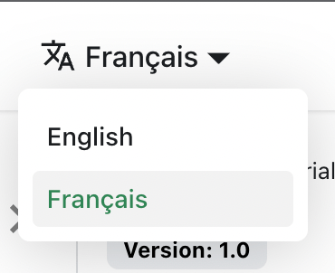

# Translate your site

Let's translate `docs/intro.md` to French.

## Configure i18n

Modify `docusaurus.config.js` to add support for the `fr` locale:

**docusaurus.config.js**


```plain text
export default {
  i18n: {
    defaultLocale: 'en',
    locales: ['en', 'fr'],
  },
};

```
## Translate a doc

Copy the `docs/intro.md` file to the `i18n/fr` folder:


```shell
mkdir -p i18n/fr/docusaurus-plugin-content-docs/current/

cp docs/intro.md i18n/fr/docusaurus-plugin-content-docs/current/intro.md

```
Translate `i18n/fr/docusaurus-plugin-content-docs/current/intro.md` in French.

## Start your localized site

Start your site on the French locale:


```shell
npm run start -- --locale fr

```
Your localized site is accessible at [http://localhost:3000/fr/](http://localhost:3000/fr/) and the `Getting Started` page is translated.

:::caution

In development, you can only use one locale at a time.

:::

## Add a Locale Dropdown

To navigate seamlessly across languages, add a locale dropdown.

Modify the `docusaurus.config.js` file:

**docusaurus.config.js**


```plain text
export default {
  themeConfig: {
    navbar: {
      items: [
        {
          type: 'localeDropdown',
        },
      ],
    },
  },
};

```
The locale dropdown now appears in your navbar:


## Build your localized site

Build your site for a specific locale:


```shell
npm run build -- --locale fr
```
Or build your site to include all the locales at once:


```shell
npm run build
```
